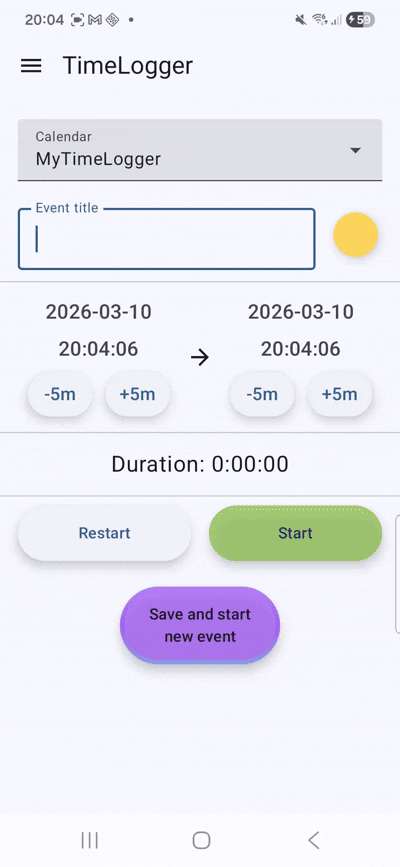
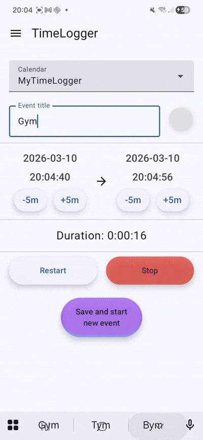

# TimeLogger

If you want to simply tracking how long you are doing things, without creating workspaces, projects, managing clients and billings systems etc, just clicking Start and Stop, TimeLogger may be for you.

TimeLogger is like a stopwatch for tasks.

Events are saved in the selected calendar, so you can browse it on you favourite calendar app or using web browser.

 
  

I you want to view simple barchart aggregation you can use Statistics screen.

Demo:

